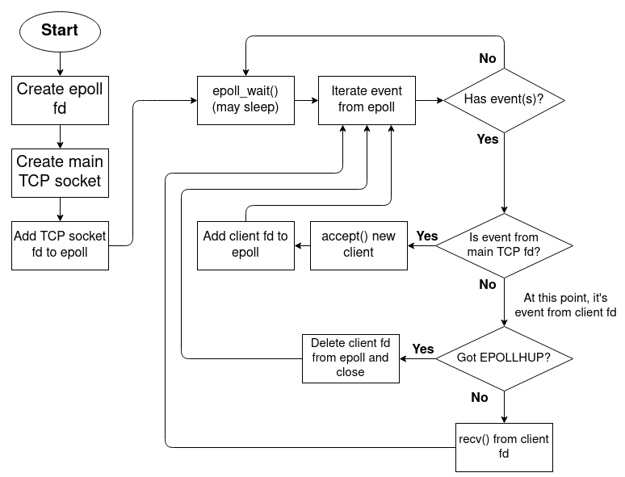

<div align="center">
  <h1 style="font-size: 36px; color: #333;">Webserv</h1>
  <p style="font-size: 18px; color: #666;">A HTTP Server written in C++ from scratch</p>
  <hr style="border: 1px solid #ddd; width: 50%;">
</div>

[HTTP Server: Everything you need to know to Build a simple HTTP server from scratch](https://medium.com/from-the-scratch/http-server-what-do-you-need-to-know-to-build-a-simple-http-server-from-scratch-d1ef8945e4fa)

[server web en C from scratch](docs/server%20web%20en%20C%20from%20scratch%20f3a66cec98944c1289af54934492bb0a.md)

[HyperText Transfer Protocol (HTTP)](https://http.dev/)

## To do:

- [ ]  Makefile (add recompiling while .hpp are changed)
- [ ]  Parsing du fichier de config
- [ ]  Gestion des requetes avec les sockets
- [ ]  Parsing des requetes
- [ ]  Creation de reponse
- [ ]  Gestion des CGI

## Creation du coeur du programme

Etre capable de recevoir et de l’analyser pour ensuite renvoyer la bonne reponse.

### Fonctions utilisees

```cpp
//convertion local vers reseau (vers big-endian)
short htons(short value);
long htonl(long value);
//convertion inverse (de big-endian)
short ntohs(short value);
long ntohl(long value);

int socket = socket(AF_INET, SOCK_STREAM, IPPROTO_TCP);
//AF_INET  pour ipv4, SOCK_STREAM pour TCP et IPPROTO_TCP pour TCP
//retourne -1 lors d'une erreur
int close(int socket) //pour fermer le socker qui est un simple fd
```



[C++ Confused by epoll and socket fd on Linux systems and async threads](https://stackoverflow.com/questions/66916835/c-confused-by-epoll-and-socket-fd-on-linux-systems-and-async-threads)

Creation d’une classe tcp_server, celle-ci permet de creer un server tcp sur un port donne.

Cette classe contiendra le fd du server tcp et les fd des differents clients.

On pourra avec cela utiliser epoll pour gerer differents server en meme temps et identifier de quel server provient le fd actif.

[The method to epoll’s madness](https://copyconstruct.medium.com/the-method-to-epolls-madness-d9d2d6378642)

[Epoll: does it silently remove fds?](https://stackoverflow.com/questions/46987302/epoll-does-it-silently-remove-fds)

[Significance of parameters in epoll_event structure (epoll)](https://stackoverflow.com/questions/24622982/significance-of-parameters-in-epoll-event-structure-epoll)

We can store a pointer into epoll_event structure to help handling events.

[](https://github.com/millken/c-example/blob/master/epoll-example.c)

[headers/sys/epoll.h - platform/prebuilts/ndk - Git at Google](https://android.googlesource.com/platform/prebuilts/ndk/+/4448347db136fb3d172c0349c32295c6691df3be/headers/sys/epoll.h)

## CGI

[The Common Gateway Interface (CGI) Version 1.1](https://www.rfc-editor.org/rfc/rfc3875.pdf)

- [ ]  Set up all the env variable needed by cgi to works correctly based on the request
- [ ]  Prepare pipes to give to cgi the requests body and to get the cgi output
- [ ]  fork and execve cgi
- [ ]  send request body throught the right pipe
- [ ]  read response from out pipe
- [ ]  send it to client ( adding status code 200 if its not in the cgi output)

## Deal with file upload

[RFC 7578: Returning Values from Forms: multipart/form-data](https://www.rfc-editor.org/rfc/rfc7578)

- [ ]  check content-type (multipart/form-data)
- [ ]  parse the body with the boundaries
- [ ]  create and fill files to put content into it

## Parsing request

[Hypertext Transfer Protocol (HTTP) Field Name Registry](https://www.iana.org/assignments/http-fields/http-fields.xhtml)

1. request line: ************************method token + “ “ + request-target + “ “ + protocol version + “\r\n” →************************ error = 400 bad request or method not implemented = 501
2. header fields: case-insensitive; ********************************************field name + “:” + optional leading whitespaces + field value + optional trailing whitespaces********************************************; ignore unrecognized herder fields; several field value can be send under the same field name and are separated by comma; no whitespace between field name and colon otherwise 400 error is throwed.
3. Content-Length must be 0 or greater, if multiple content-length field, reject request by 400 error; no content-length and transfer-encoding is not chunked = 411 error
4. Incomplete request = throw error ( 400 probably ) and close connection
5. Host field: error if multiple host or no host for HTTP/1.1; need to verify host value to know if 400 error have to be sent

[RFC 3986: Uniform Resource Identifier (URI): Generic Syntax](https://datatracker.ietf.org/doc/html/rfc3986#section-3.2.2)

## Request execution

1. body into GET or DELETE request = 400 error
2. DELETE →delete the ressource
3. POST → create ressource with body or append data in existing file
4. create map to determine Content-Type

## Build a header

1.
